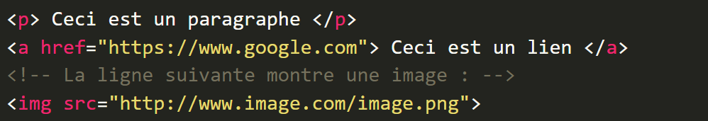
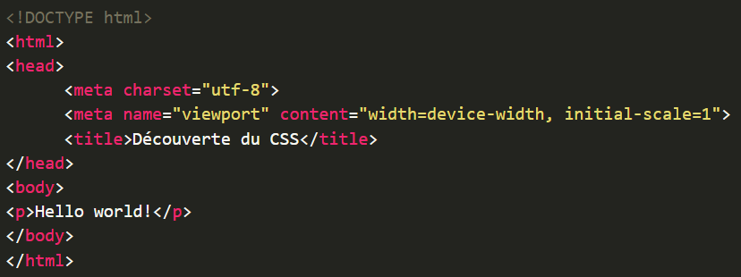
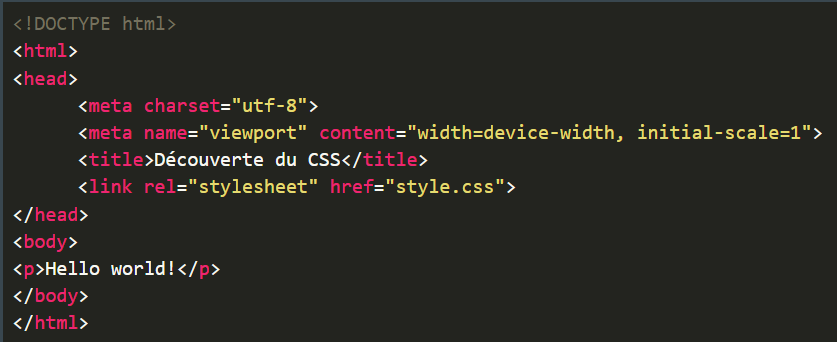
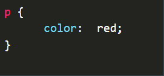
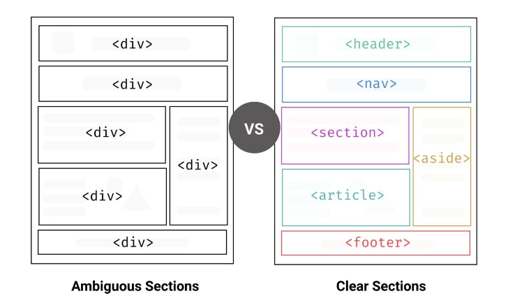
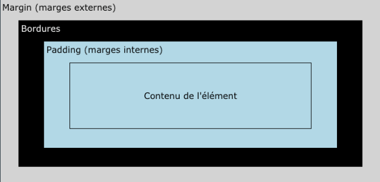
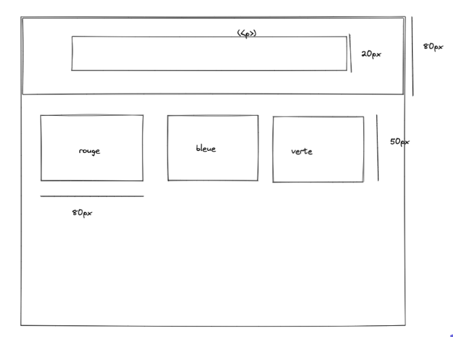
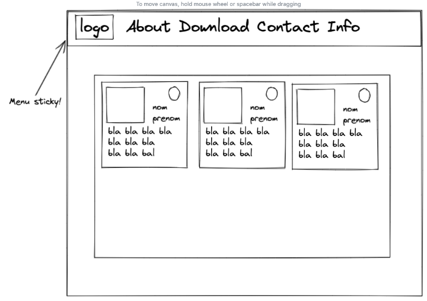
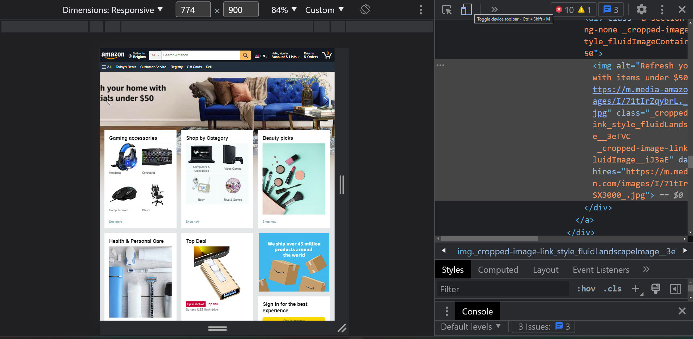

# HTML - CSS


## 1.Presentation et objectif de ses 5 jours

- Qui suis-je
- Qui êtes vous ?
- Quel est votre niveau informatique ?
- Ce que vous attendez de la formation

## 2.Presentation des outils et installation

- VS code : [Téléchargement](https://code.visualstudio.com/).
vs code est ce que l'on appelle un IDE ( intégrated developement environement )
c'est un outil de traitement de texte et de code qui nous facilite la création de site web,
application et bien d'autre.

- Inspecteur du navigateur
l'inspecteur est un outils présent dans tout les navigateur(Firefox, Opera,
 Edge, Chrome, ..)
C'est un outils indispensable pour les développeur web , il permet :
d'identifier des erreurs, des comportement voir même la vitesse/réactivité de notre page web

- Un dossier vide
Aussi simple que cela puisse paraitre tout les site internet
commencent dans un dossier vide, c'est ce que nous allons faire
avec notre première page html qui devrais ressembler a quelque chose comme ça :
[Premiere page web](http://info.cern.ch/hypertext/WWW/TheProject.html)

## 3. Un peu de théorie

- Le HTML ?
Le html est un langage dit de balisage (dit descriptif de donnée)
il nous permet de définir les diffèrent bloc de notre page web.



- La balise en detaille.


- Et voici la structure indispensable a une page web.


## Exercice : 

- Inspectez la page d'accueil de Wikipedia d'un personnage publique et modifiez:

- La balise head et son contenu 
- La balise body et son contenu
- 3 balises quelconques pour lesquelles vous modifierez les attributs et contenu
- Pour finir modifiez une partie du css de ses derniers 

### Exemple css
Voici une page html sans css : 



Voici une page html avec css :





## Exercice :

- Créez une page html

- Ajouter votre nom et prenom en titre principale 

- Ajoutez une photo miniature et un lien vers la photo initiale

- Ajoutez 3 sections avec un titre secondaire ( mon experience , mes compétences , ma formation ) [ chaque section contient un paragraphe ou une liste à puce]

- Ajoutez different titre , chacun ayant une taille differente 

[Example](codepen.io/Michamp/pen/LYQrPPv)


## 4.Containers , positionnement et comportement des elements .

### Liste des principales balises container : 

- div
- section
- article
- main
- header
- footer
- nav

Les containers servent à structurer votre code HTML



Chaque élément HTML est affiché en considérant le modèle suivant :



### Propriété css fréquemment rencontrées : 

- Les propriétés width et height vont nous permettre de
définir la largeur et la hauteur de la boite « contenu »

- La propriété padding va nous permettre de définir la taille des marges internes
Important : le background ne s’applique QUE dans le padding !

- La propriété padding va nous permettre de définir la taille des marges internes
Important : le background ne s’applique QUE dans le padding!

- La propriété margin va nous permettre de définir la taille des marges externes.
Rem: la propriété margin varie entre deux éléments similaires

- display est une propriété très puissante puisqu’elle va nous permettre de modifier
la façon dont un élément va s’afficher dans la page : en ligne, sous forme de bloc, etc.
et donc la façon dont il va se comporter avec ses voisins:
inline : Les éléments de type inline vont venir essayer de se placer en ligne…,
block : Un élément de type block va toujours prendre toute la largeur disponible au sein de son
élément parent. Un élément de type block va toujours « aller à la ligne »
Un élément de type block peut contenir d’autres éléments de type block ou de type inline
Un élément de type inline ne peut pas contenir d’éléments de type block


### Les propriétés CSS liées aux différentes conteneurs

- Les propriétés width et height vont nous permettre de définir la largeur et la hauteur de la boite « contenu »

- La propriété padding va nous permettre de définir la taille des marges internes 
**remarque : le background ne s’applique QUE dans le padding!**

- La propriété border va nous permettre de définir des bordures pour notre élément 

- La propriété margin va nous permettre de définir la taille des marges externes.
**remarque : la propriété margin varie entre deux éléments similaires**

- La propriété box-sizing: border-box indique que l’on souhaite inclure les marges internes et les bordures dans le calcul de la taille d’un élément.

- La propriété display va nous permettre de définir un type d’affichage pour un élément

- display est une propriété très puissante puisqu’elle va nous permettre de modifier la façon dont un élément va s’afficher dans la page : en ligne, sous forme de bloc, etc. et donc la façon dont il va se comporter avec ses voisins

- Les éléments de type inline vont venir essayer de se placer en ligne , Un élément de type inline ne va occuper que la largeur nécessaire à l’affichage de son contenu par défaut.

- Un élément de type block va toujours prendre toute la largeur disponible au sein de son élément parent. Un élément de type block va toujours « aller à la ligne » , Un élément de type block peut contenir d’autres éléments de type block ou de type inline


### Pour resumer :

**propriété display**

- block :
        prend toute la largeur de l'ecran , retourne à la ligne 
        hauteur et largeur modifiable , peut contenir d'autre éléments block et inline
        ex: ```<div>,<p>```

- inline :
        espace minimum , se suivent l'un derrière l'autre
        hauteur et largeur mnon modifiables et ne peut contenir
        ex: ```<span>```

- inline-block :
        comme inline mais on peut modifier hauteur et largeur
        ex:``````

- none :
        l'élément n'est pas du tout affiché ( ni même visible)

-flex et grid :
        pour mettre en place des layout ( que nous verrons plus tard )


## Exercice

- Realisez la maquette suivant en respectant les indication de box model indiquées ( certaines sont incomplètes )




### Liste des balises utilisées 

``` 
<html>      <head>      <body>
<meta>      <link>      <nav>
<p>         <a>         <q>
<header>    <footer>    <main>
<aside>     <section>   <article>
<span>      <div>
<table>     <th>    <tr>    <td>

``` 

### Liste des proprièté CSS 

```

display
color
background-color
margin
padding
border
width
height
box-sizing

```

Ref pour les differentes balises et proprieté css :

- HTML:
https://www.w3schools.com/tags/default.asp

http://html5doctor.com/element-index/

https://developer.mozilla.org/fr/docs/Web/HTML


- CSS:
https://www.w3schools.com/css/css_intro.asp

https://developer.mozilla.org/fr/docs/Web/CSS


Note: Mozilla MDN Web Docs peut être affiché en français

N’hésitez pas à Googler ou chercher directement sur Youtube des mots clés


## 5.Sélecteurs CSS : introduction

- Sélectionner une balise

``` 
p {
	color:  red;
}
```
- Sélectionner une classe

```
.boite {
	display: inline-block;
}
```

- Sélectionner un id

``` 
#box-important {
	color: red;
}
```
- Sélectionner par référence à un parent
```
.box1 .box2 {
	color: red;
}
```

- Sélectionner un élément dans un autre

``` 
.box1 > .box2 {
	color: red;
}
```

- Pseudo sélecteur de survol d’un élément

``` 
p:hover{
    background-color:red;
}

```


## Exercices 

Repondre au question ecrit en commentaire dans le bloc CSS : [exercices](https://codepen.io/Michamp/pen/XWZBVxa)

### Réferences 

[Liste des sélecteurs:](https://www.w3schools.com/cssref/css_selectors.asp)

[Jeu sur les sélecteurs CSS :](https://flukeout.github.io/ )


## Positionner un élément

- La propriété position va nous permettre de de définir un type de positionnement
        La valeur static est la valeur par défaut de la propriété position. 
        Un élément HTML positionné avec position : static sera positionné selon le flux normal de la page.

- les propriétés top, left, bottom et right n’auront aucun effet sur les éléments positionnés avec position : static.

- Attribuer une position : relative à un élément va positionner l’élément dans le flux normal de la page tout comme position : static.
        position : relative va ensuite pouvoir être décalé par rapport à sa position initiale grâce aux propriétés top, left, bottom et right.

- Un élément positionné avec position: absolute va être positionné par rapport à son parent le plus proche positionné.
        Le point de référence pour les propriétés top, left, bottom et right va ainsi être le côté de l’élément parent.Un élément positionné avec position: absolute va ainsi pouvoir se placer par-dessus d’autres éléments.
        *La seule différence entre position: fixed et position: absolute est que l’élément ne va plus être positionné par rapport à son parent le plus proche mais par rapport au viewport, c’est-à-dire par rapport à la fenêtre visible*

**resumer**

### propriété position

- static : propriété par défaut, ne change rien

- relative : comportement par défaut identique à static on peut modifier : top, left, right, bottom
        déplace l’élément “au dessus” des autres

- absolute : enlève l’élément de sa position normale le reste s’affiche comme si l’élément n’était pas là
        top, left, right, bottom sont relatifs au parent (html par défaut)

- fixed : colle l’élément au viewport ,on positionne avec top, left, right, bottom

- sticky : comportement par défaut identique à relative ,dès qu’on scrolle cela se transforme en fixed


[liste des positions avec un exemple :](https://codepen.io/Michamp/pen/PoQBQYY )

[Exemple pour sticky uniquement :](https://codepen.io/Michamp/pen/KKQBQwa )

### Exercices



[Exemple à completer](https://codepen.io/Michamp/pen/JjpBpbe)
*Collez le code html , css dans les fichier respectif sur vscode pour vous simplifier la vie*

[Correction](https://codepen.io/Michamp/pen/xxYJYRy)

## Grid et Flex

- Dans le developement front-end il y a 2 grande ecole de positionnement : Grid et Flex
        ce sont deux façon de positionner les differents elements et groupe d'element sur sa page web
        ce sont deux technique bien distincte qui ne font pas bon menage ensemble donc tester les deux
        et choisisez celui qui vous semble le plus logique ! 

- Pour vous aider dans ce choix voici un exemple et 2 plateforme pour apprendre en jouant a un petit jeu de position

    [Exemple du grid et du flex ](https://codepen.io/Michamp/pen/KKQBQXv)

    [Jeu Flexbox](https://flexboxfroggy.com/)

    [Jeu Grid](https://cssgridgarden.com/)

    [Guide complet du Flexbox](https://css-tricks.com/snippets/css/a-guide-to-flexbox/)
    [Video Flexbox](https://www.youtube.com/watch?v=phWxA89Dy94)

    [Guide complet du Grid](https://css-tricks.com/snippets/css/complete-guide-grid/)
    [Video Grid](https://www.youtube.com/watch?v=EiNiSFIPIQE)


## 6.Qu’est-ce que le responsive ?

Une page responsive est simplement une page HTML qui s’affiche correctement sur tous les types d’écrans :

- Ordinateur de bureau
- téléphone
- tablette
- montre connectée

Ce n’est pas une partie fixe et définie du CSS, comme flexbox, grid, etc. mais un ensemble de techniques utilisées dans l’objectif d’un bon affichage sur tout type d’écran. Ex:  burger menu


### Exercice :
Analyser, comparer les 2 versions desktop et mobile d'un site avec l’inspecteur. Que voyez-vous ?



**remarque balise meta**
``` 
<meta name="viewport" content="width=device-width, initial-scale=1">
```

Cete balise nous aidera pour une bonne visibilité du contenu du site : 

width=device-width :  force la largeur de l’écran à faire tout le viewport, évite des bugs d’affichages sur petits écrans

initial-scale=1 : force le zoom à être de 100% au chargement de la page


[sans la balise meta : ]( https://www.w3schools.com/css/example_withoutviewport.htm)

[avec la balise meta : ](https://www.w3schools.com/css/example_withviewport.htm)


**utilisation de max-width et min-width**

``` 
.card {
	width:  70%;
	min-width: 500px;
	max-width: 1000px;
	/*etc.*/
}
```
Dans cet exemple nous avons :
    une carte dont la taille varie mais entre deux limites fixes .

### Exercices

Reprendre le code avec les cartes et le rendre responsive au sens que l’on vient de voir : accorder une taille variable avec une largeur minimum et maximum aux cartes

[Codepen avec les cartes : ](https://codepen.io/Michamp/pen/xxYJYRy)

*Note:  vous pouvez refaire l’exercice de zéro avec des cartes à vous.*


## responsive fonts

```
font-size: 5vw; /* proportionnel à la LARGEUR! du navigateur*/
font-size: max(3vw, 35px);
font-size: min(3vw, 35px);
```

- l'unité de mesure rem : 
        Il existe une unité de longueur qui est la taille de la police dans l’élément html, c’est rem. 
        Utile pour l’accessibilité :  modifier la taille des polices (méthode de 62.5%) => exemple
        Peut être utilisé pour dimensionner autre chose qu’une police
        note : par défaut html possède une font-size de 16px
        Utile dans les media queries : changer la font-size de html en pourcentage (voir plus loin)
        ex:
        ```
        html {
            font-size: 16px;
        }

        .card {

            font-size: 2rem; /* équivalent à 2*16 = 32px */

        }
        ```
- l'unité de mesure em :
        L’unité em fait référence à la taille de la police du parent 
        Si aucun parent n’a de taille de font définie alors 1em vaudra la taille de l'élément root, donc 16px
        Peut être utilisé pour dimensionner autre chose qu’une police
        pratique pour dimensionner la police de tout une portion du site, typiquement une section, pour laquelle la taille sera définie puis héritée par tous ses enfants
        ```
        .card {
            font-size: 20px;
        }
        .card p {

            font-size: 2em; /* équivalent à 40px */
        }
        ```
- media queries
        Il existe en CSS des propriétés appelées média queries qui permettent de changer le CSS en fonction (entre autres) de la largeur de l’écran

        ```
        /* Si la largeur est entre 600px et 900px OU au dessus de 1100px - changer l’apparence de la div */
        @media screen and (max-width: 900px) and (min-width: 600px), (min-width: 1100px) {
            div.example {
                font-size: 50px;
                padding: 50px;
                border: 8px solid black;
                background: yellow;
                }
        }

        ```
    ref : https://www.w3schools.com/css/css3_mediaqueries.asp

[Exemple responsive](https://codepen.io/Michamp/pen/OJQwBby)


### Seuils standards - breakpoints

- 320px — 480px		appareils mobiles
- 481px — 768px 		iPads, tablettes
- 769px — 1024px		petits écrans, laptops
- 1025px — 1200px	desktops, grands écrans
- 1201px et plus 		écrans extra large,  TV


https://www.freecodecamp.org/news/css-media-queries-breakpoints-media-types-standard-resolutions-and-more/


### Utiliser flexbox dans un media queries

Comme on l’a vu, flexbox permet de facilement aligner des éléments en rangées ou colonnes. On peut l’utiliser pour facilement passer d’un alignement en rangées à un alignement en colonnes en utilisant une media query.


```
.container {
	display: flex;
	/*default value :*/
	/*flex-direction: row;*/
}


@media screen and (max-width: 768px){
	.container {
		flex-direction: column;
	}
}

```


