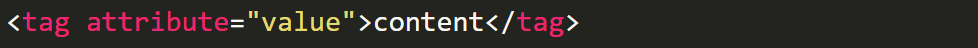
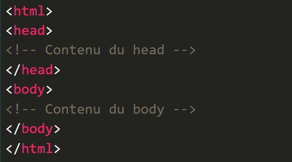

# HTML - CSS
## 1.Presentation et objectif de ses 5 jours
- Qui suis-je
- Qui êtes vous ?
- Quel est votre niveau informatique ?
- Ce que vous attendez de la formation

## 2.Presentation des outils et installation
- VS code : [Téléchargement](https://code.visualstudio.com/).
vs code est ce que l'on appelle un IDE ( intégrated developement environement )
c'est un outil de traitement de texte et de code qui nous facilite la création de site web,
application et bien d'autre.

- Inspecteur du navigateur
l'inspecteur est un outils présent dans tout les navigateur(Firefox, Opera,
 Edge, Chrome, ..)
C'est un outils indispensable pour les développeur web , il permet :
d'identifier des erreurs, des comportement voir même la vitesse/réactivité de notre page web

- Un dossier vide
Aussi simple que cela puisse paraitre tout les site internet
commencent dans un dossier vide, c'est ce que nous allons faire
avec notre première page html qui devrais ressembler a quelque chose comme ça :
[Premiere page web](http://info.cern.ch/hypertext/WWW/TheProject.html)

## 3. Un peu de théorie
- Le HTML ?
Le html est un langage dit de balisage (dit descriptif de donnée)
il nous permet de définir les diffèrent bloc de notre page web
.

la balise en detaille 

et voici la structure indispensable a une page web
